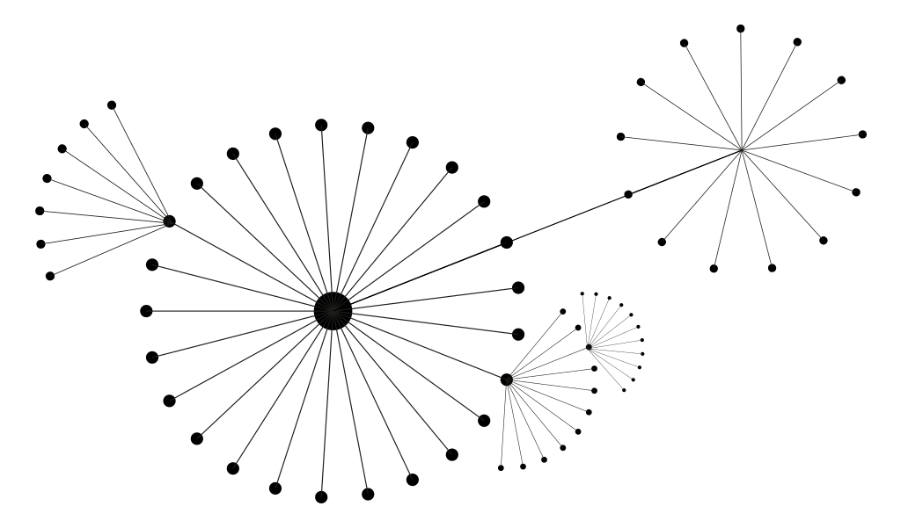

> [!warning] This garden is still in beta and not ready for publishing!
> Please do not link to it so far. Some pages are finished, but a lot is missing and or under heavy construction. Come back soon!

I'm Tilman Zitzmann, professor for Digital Experience Design at Technische Hochschule Nürnberg Georg Simon Ohm (the Ohm).

## This Is My Digital Garden

This is a digital garden – a collection of evolving notes and ideas about design research. Nothing here is finished. Pages grow, change, and connect to each other over time. Some are rough seedlings, others more developed.

## Why I'm Here

I've been passionate about the web since the 1990s. I've run my own website since 1998 in various forms. Before teaching, I worked professionally in web design and development for over a decade at design studios. I witnessed the web's evolution from an open, creative space to today's platform-dominated landscape. This concerns me.

In 2012, I started [Geometry Daily](https://geometrydaily.tumblr.com) – a minimal geometric composition every day, posted immediately on Tumblr. The project found an audience I never expected. That success showed me what authentic, focused creative work could do online.

The large social media platforms have become extractive and hostile. Web development has grown unnecessarily complex. Much of the web is now bloated with tracking and ads that serve corporations, not users.

This research explores how creative practitioners can reclaim the web by running their own independent websites. My goal is practical: to show that this is achievable, worthwhile, and perhaps the best way to publish creative work today.

I secured a research partnership with [Hetzner](https://www.hetzner.com), one of Europe's largest data center operators, providing free web hosting for students and staff.

## Topics

- [[Basic Web Technology]]
- [[Why Creative Practitioners Need Their Own Websites]]
- [[Alternative Web Movements Overview]]
- [[Inspiring Websites]]

Start wherever interests you. Follow the links. Come back as ideas develop.
